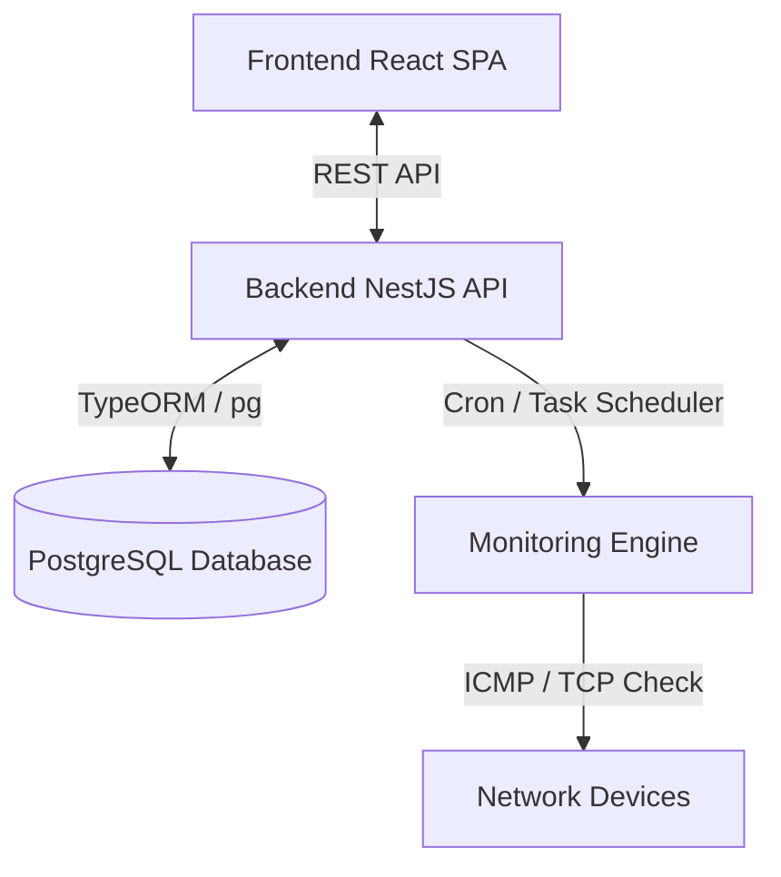

# Requirements Specification: Uptime Monitor

This document outlines the functional and non-functional requirements for the **Uptime Monitor** application. The system is designed to monitor the availability and latency of local network devices using ICMP Ping and TCP Port checks, built with a technology stack of **NestJS**, **React**, and **PostgreSQL**.

---

## 1. Project Overview & Objectives

The **Uptime Monitor** is a network diagnostics tool designed to track the availability and latency of local network devices (e.g., servers, routers, workstations) in real-time. It provides administrators with a single dashboard to manage devices, inspect current/historical network status, and configure monitoring behaviors.

### Objectives
- Periodically check device availability using network protocols (ICMP Ping and TCP Connection checks).
- Store historical latency and status information in a database.
- Offer a user-friendly, responsive interface for network management and visual analytics.
- Enable dynamic configuration of checking intervals without requiring server restarts.

---

## 2. System Architecture & Tech Stack

The application follows a standard Client-Server architecture:



- **Frontend**: React (TypeScript, CSS / Tailwind CSS for styling)
- **Backend**: NestJS (TypeScript, dynamic scheduling using `@nestjs/schedule`)
- **Database**: PostgreSQL (relational storage for configuration, devices, logs, and incidents)
- **Network Interfaces**:
  - ICMP: System command `ping` or native Node.js wrapper.
  - TCP: Node.js `net.Socket` connection.

---

## 3. Functional Requirements (FR)

### FR-1: Device Management (CRUD)
The system must allow users to manage the inventory of devices (hosts) to be monitored.

- **FR-1.1**: The system must support creating a new device monitor with the following attributes:
  - **Name**: User-friendly identifier (e.g., "Main Router").
  - **Host**: IP address (IPv4/IPv6) or domain name (e.g., `192.168.1.1` or `router.local`).
  - **Protocol Type**: `ICMP` (Ping) or `TCP` (Port check).
  - **Port**: Network port number (1-65535, required only if Protocol Type is `TCP`).
  - **Is Active**: Boolean flag to enable or disable monitoring for the device.
- **FR-1.2**: The system must validate inputs:
  - Host must be a valid IP format or domain name.
  - Port must be a number between 1 and 65535 when TCP protocol is selected.
  - Duplicate device configurations (same Host + Protocol + Port combination) should trigger a warning/error.
- **FR-1.3**: The system must allow listing all devices with their configuration and current live status.
- **FR-1.4**: The system must allow updating any attribute of a device. If a device is updated, subsequent health checks must use the updated parameters.
- **FR-1.5**: The system must support deleting a device. Deletion should cascade and clean up all historical logs and incidents associated with that device.

### FR-2: Monitoring Engine
The background service responsible for evaluating device connectivity.

- **FR-2.1**: The system must run checking cycles based on the **Global Monitoring Interval**.
- **FR-2.2**: The monitoring check must execute asynchronously to avoid blocking the main server thread.
- **FR-2.3**: **ICMP Ping Protocol**:
  - Send an ICMP echo request to the target host.
  - Track response latency in milliseconds.
  - If a response is received successfully, mark the state as `UP`.
  - If the host is unreachable or times out (default timeout: 3 seconds), mark the state as `DOWN`.
- **FR-2.4**: **TCP Port Check Protocol**:
  - Attempt to establish a raw TCP connection to the host on the specified port.
  - Track the elapsed time to establish connection in milliseconds.
  - If the socket connection succeeds, close it immediately and mark the state as `UP`.
  - If connection is refused, times out (default timeout: 3 seconds), or fails, mark the state as `DOWN`.
- **FR-2.5**: For every monitoring check, the system must write a record to the `MonitoringLog` table:
  - Timestamp.
  - Device ID.
  - Status (`UP` or `DOWN`).
  - Latency (in milliseconds, or `null` if DOWN).
  - Error message (if DOWN, detailing the cause, e.g., "Connection Timeout" or "Connection Refused").

### FR-3: Global Configuration Settings
The system must persist user settings to govern application behavior.

- **FR-3.1**: The user must be able to change the **Global Monitoring Interval** via the UI.
  - Supported options: 10 seconds, 30 seconds, 1 minute, 5 minutes, 10 minutes, 30 minutes, 1 hour.
- **FR-3.2**: When the monitoring interval is updated, the NestJS scheduler must dynamically reschedule the background cron/interval job to match the new duration without requiring a server reboot.
- **FR-3.3**: The interval settings must be persisted in the database so they are preserved across application restarts.

### FR-4: Dashboard & Metrics Visualizer (Frontend)
The user interface must present monitoring metrics in an intuitive manner.

- **FR-4.1**: **Overview Cards**: Show aggregate statistics:
  - Total Devices.
  - Total Active Monitors.
  - Devices Up (Count).
  - Devices Down (Count).
- **FR-4.2**: **Live Status Grid**:
  - List of active/inactive devices.
  - A clear visual indicator for the status (e.g., Green badge for `UP`, Red badge for `DOWN`, Grey badge for `INACTIVE`).
  - Display the last check timestamp and the latest recorded latency.
  - Display the average latency and uptime percentage calculated over the selected time range.
- **FR-4.3**: **Performance Charts**:
  - Visualizing latency over time for individual devices.
  - A line chart showing response times in milliseconds over the last 24 hours.
- **FR-4.4**: **Historical Uptime Calculation**:
  - Calculate Uptime % as `(Number of UP checks / Total checks executed) * 100` over a defined window (e.g., last 24h, last 7 days).

### FR-5: Incident & Event History
Tracking outages and status transitions.

- **FR-5.1**: An **Incident** is created whenever a device transitions from `UP` to `DOWN`.
- **FR-5.2**: The Incident record must contain:
  - Device ID.
  - Outage Start Time.
  - Outage End Time (updated when the device returns to `UP`).
  - Total outage duration in seconds.
- **FR-5.3**: **Incident Logs UI**:
  - Display a chronologically sorted list of outages.
  - Highlight unresolved incidents (where the device is still `DOWN`).
  - Display downtime durations.

---

## 4. Non-Functional Requirements (NFR)

### NFR-1: Performance & Latency
- The monitoring engine must run checks concurrently up to a configurable pool limit (e.g., 20 concurrent pings) to avoid lagging when monitoring multiple devices.
- Backend API endpoints should respond within 200ms under standard loads.

### NFR-2: Reliability & Fault Tolerance
- If a system command execution fails (e.g., missing system permissions for `ping`), the backend must log the error gracefully, switch to an internal ping strategy or report a degraded service state.
- In case of database disconnection, the backend must buffer the checks in memory (temporary queue) or log them to stderr until connectivity is restored to prevent data loss.

### NFR-3: Data Retention & Clean-up
- Standard database records of raw checks (`MonitoringLog`) can accumulate rapidly. The system must implement a retention limit (e.g., delete logs older than 30 days) to keep database sizes manageable.
- Incidents history should be kept indefinitely or for a longer window (e.g., 365 days) for SLA reports.

### NFR-4: Usability & UI/UX
- Responsive design: The dashboard must adapt to desktop, tablet, and mobile views.
- Supported themes: Dark Mode must be implemented as the default styling approach, given the project references.

---

## 5. Database Schema Reference

```sql
-- Devices representation
CREATE TABLE devices (
    id UUID PRIMARY KEY DEFAULT gen_random_uuid(),
    name VARCHAR(255) NOT NULL,
    host VARCHAR(255) NOT NULL,
    protocol VARCHAR(10) CHECK (protocol IN ('ICMP', 'TCP')),
    port INTEGER CHECK (port >= 1 AND port <= 65535),
    is_active BOOLEAN DEFAULT TRUE,
    created_at TIMESTAMP WITH TIME ZONE DEFAULT CURRENT_TIMESTAMP,
    updated_at TIMESTAMP WITH TIME ZONE DEFAULT CURRENT_TIMESTAMP
);

-- Individual test result logs
CREATE TABLE monitoring_logs (
    id UUID PRIMARY KEY DEFAULT gen_random_uuid(),
    device_id UUID REFERENCES devices(id) ON DELETE CASCADE,
    status VARCHAR(10) CHECK (status IN ('UP', 'DOWN')),
    latency INTEGER, -- null if DOWN
    error_message TEXT,
    timestamp TIMESTAMP WITH TIME ZONE DEFAULT CURRENT_TIMESTAMP
);

-- Incidents tracking (uptime/downtime events)
CREATE TABLE incidents (
    id UUID PRIMARY KEY DEFAULT gen_random_uuid(),
    device_id UUID REFERENCES devices(id) ON DELETE CASCADE,
    started_at TIMESTAMP WITH TIME ZONE NOT NULL,
    resolved_at TIMESTAMP WITH TIME ZONE, -- null if still DOWN
    duration INTEGER -- duration in seconds, null if unresolved
);

-- System global settings
CREATE TABLE settings (
    key VARCHAR(255) PRIMARY KEY,
    value VARCHAR(255) NOT NULL,
    updated_at TIMESTAMP WITH TIME ZONE DEFAULT CURRENT_TIMESTAMP
);
```
